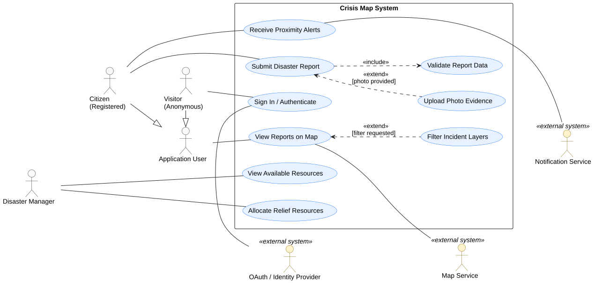

# 3. Obrasci uporabe

**Cilj:** Prikazati glavne interakcije između aktera aplikacije i sustava. Opišite kako akter ostvaruje cilj i što se događa kada važan korak ne uspije. Interakcije temeljite na odobrenim zahtjevima i ažurirajte ih kako se aplikacija razvija.

## 3.1 Dijagram obrazaca uporabe

**Cilj:** Prikazati granicu sustava, relevantne aktere i njihove glavne ciljeve u **jednom čitljivom UML dijagramu obrazaca uporabe**. Dodajte drugi, usmjereni dijagram samo ako potpuni prikaz više ne može ostati čitljiv; treći dijagram zahtijeva zaseban razlog specifičan za projekt.

**Slika 3.1. Dijagram obrazaca uporabe sustava CrisisMap**

**PlantUML izvor:** [izvor](./puml/3-1-crisismap-system-UC.puml)

**Provjera dijagrama:** Prikažite prepoznate uloge koje **komuniciraju s aplikacijom**, a ne dionike koji s njom nemaju interakciju. Svaki glavni korisnički cilj mora imati pridruženog aktera; uključeni obrazac uporabe može se dosegnuti preko drugog obrasca uporabe bez vlastite izravne veze s akterom. `<<include>>` i `<<extend>>` koristite samo kada odnos odgovara stvarnom ponašanju.

<strong>Primjer odabira aktera i granica sustava</strong>

**Opis primjera — CrisisMap:**

Dijagram prikazuje **ogledni scenarij** s građaninom, posjetiteljem i organizacijom koja provjerava dostupne resurse. Organizaciju uključite kao aktera samo ako joj odobreni projekt stvarno omogućuje interakciju s aplikacijom. OAuth je izvan ovog primjera jer je riječ o implementacijski specifičnom načinu prijave i pripada zahtjevima samo ako je odobren.

**Odabir aktera i ciljeva:** Granica pokazuje što aplikacija nudi, akteri imaju različite ciljeve, a nijedan akter ni obrazac uporabe ne tvrdi da ova studentska aplikacija angažira hitne službe. Dijagram usporedite s odobrenim funkcijskim zahtjevima i akterima.

**Pet pitanja za odabir sadržaja dijagrama** (ne pet dijagrama za predaju):

| Fokus | Pitanje |
| --- | --- |
| Cijeli sustav | Koji korisnički ciljevi najbolje objašnjavaju čemu ova aplikacija služi? |
| Ključne funkcionalnosti | Koje ciljeve treba detaljnije opisati ili, ako je potrebno, prikazati zasebnim usmjerenim dijagramom? |
| Korisničke uloge | Koji akteri mogu sudjelovati u pojedinom cilju i kako se njihove ovlasti razlikuju? |
| Ključni procesi | Koji cilj ima važne alternative koje treba opisati u obrascu uporabe? |
| Vanjske integracije | Sudjeluje li drugi sustav u obrascu uporabe kao **sekundarni akter**, primjerice odobreni pružatelj identiteta pri prijavi? |

Vanjski sustav može biti sekundarni akter obrasca uporabe kada sudjeluje u ostvarenju korisničkog cilja; tehničke veze opisuju se u arhitekturi. Nemojte stvarati dodatni obavezni dijagram obrazaca uporabe samo radi popisa integracija. Prenatrpan dijagram podijelite prema povezanim akterima ili ciljevima samo kada time postaje čitljiviji.

## 3.2 Specifikacije obrazaca uporabe

**Cilj:** Za svaki obrazac uporabe iz dijagrama objasniti cilj aktera, uobičajenu interakciju s aplikacijom i važne alternative. Jednostavne obrasce uporabe opišite kratko; proširite one kod kojih alternative, vanjske ovisnosti ili posljedice zahtijevaju dodatno objašnjenje.

**Za svaki obrazac uporabe koristite jednu okomitu tablicu.** Navedite samo onoliko pojedinosti koliko interakcija zahtijeva; neprimjenjivu alternativu izostavite umjesto da je popunjavate samo radi forme.

### UC-[ID]: [Naziv usmjeren na cilj]

| Element specifikacije | Opis |
| :--- | :--- |
| **Primarni akter** | [Uloga definirana u analizi zahtjeva] |
| **Povezani zahtjevi** | [Identifikatori funkcijskih zahtjeva, npr. F-001, F-004] |
| **Preduvjeti** | [Stanje sustava koje mora biti zadovoljeno prije početka izvođenja] |
| **Glavni uspješni tok** | 1. Akter pokreće akciju. 2. Program obrađuje unos i vraća povratnu informaciju. 3. [Koračni prikaz interakcije do ostvarenja cilja] |
| **Alternativni tokovi / Iznimke** | **[Korak]a — [Naziv iznimke]:** [Uvjet nastanka, reakcija programa i nastavak toka] |
| **Posljedice (ishod)** | [Promjena stanja podataka ili potvrda nakon uspješnog završetka] |

<strong>Primjeri specifikacija: Registracija i prijava kriznog događaja</strong>

**Primjer — CrisisMap:**

**UC-001: Registracija računa.** Ovaj kratki primjer odnosi se na projekt čiji odobreni zadatak uključuje račune s adresom e-pošte i lozinkom.

| Polje | Opis |
| --- | --- |
| Primarni akter | Građanin (A-02 u primjeru) |
| ID zahtjeva | F-001 |
| Preduvjeti, ako postoje | Nema. |
| Glavni tijek | Građanin unosi adresu e-pošte; aplikacija šalje poveznicu za potvrdu; građanin potvrđuje račun. |
| Alternativni ili neuspješni tijekovi, ako postoje | Adresa e-pošte već postoji → aplikacija objašnjava zašto se registracija ne može nastaviti. |
| Rezultat | Račun je aktivan nakon potvrde. |

Ako odobreni zadatak umjesto toga koristi isključivo OAuth prijavu, zamijenite ovaj primjer odgovarajućim ponašanjem prijave; nemojte dodavati registraciju lokalnom lozinkom samo radi podudaranja s primjerom.

**UC-002: Podnošenje prijave kriznog događaja.** Ista polja mogu opisati dulji tijek u kojem odabir lokacije, provjera valjanosti i pohrana mogu ne uspjeti.

| Polje | Opis |
| --- | --- |
| Primarni akter | Građanin |
| ID zahtjeva | F-004 |
| Preduvjeti, ako postoje | Obrazac za prijavu dostupan je. Ako odobreni zadatak zahtijeva prijavu u sustav, građanin je prijavljen. |
| Glavni tijek | 1. Građanin otvara obrazac za prijavu; aplikacija prikazuje polja za vrstu kriznog događaja, razinu ozbiljnosti, opis i lokaciju. 2. Građanin unosi podatke i odabire lokaciju na karti ili drugim podržanim načinom. 3. Građanin podnosi obrazac; aplikacija provjerava obavezna polja i lokaciju. 4. Aplikacija pohranjuje prijavu i prikazuje potvrdu s referencom na nju. |
| Alternativni ili neuspješni tijekovi, ako postoje | **1a — Prijava u sustav nije uspjela:** Ako je prijava obavezna, a pružatelj identiteta je ne dovrši, prijava kriznog događaja ostaje nepodnesena i aplikacija objašnjava kako pokušati ponovno. **2a — Odbijen pristup lokaciji:** Ako aplikacija nudi geolokaciju, ali je korisnik odbije, građanin ručno odabire lokaciju ako ta mogućnost postoji; tijek se nastavlja u koraku 3. **3a — Nevaljana ili nedostajuća lokacija:** Aplikacija objašnjava problem, po mogućnosti zadržava unesene podatke i ne pohranjuje prijavu; građanin ispravlja lokaciju i ponavlja korak 3. **3b — Pohrana nije uspjela:** Aplikacija prijavljuje neuspjeh i ne prikazuje lažnu potvrdu o podnošenju. |
| Rezultat | Aplikacija pohranjuje prijavu kriznog događaja i potvrđuje njezino podnošenje. |

**Odabir razine detalja:** Oba primjera koriste ista polja. UC-001 je kratak jer je glavna iznimka jasna; UC-002 zahtijeva numerirane korake i alternative jer oni mijenjaju ishod i mogu usmjeravati ispitivanje. Uklonite grane prijave u sustav ili geolokacije koje ne postoje u stvarnoj aplikaciji tima. Obavještavanje spasilačkih timova, pokretanje akcije spašavanja ili dostavljanje povratnih informacija interventnih službi uvodi **zasebne mogućnosti s vanjskim posljedicama**; dokumentirajte ih samo ako ih odobreni zadatak i implementacija podržavaju. Oporavak lozinke odnosi se na račune s lokalnom lozinkom, a ne automatski na zadatak koji koristi isključivo OAuth. Pri prilagodbi primjera koristite ID-ove zahtjeva i ponašanje vlastite aplikacije.

**UC-005: Moderiranje prijave kriznog događaja.** Ovaj primjer vrijedi samo za projekt u kojem odobreni opseg uključuje moderatorski pregled prijava.

| Polje | Opis |
| --- | --- |
| Primarni akter | Moderator (A-05 u primjeru) |
| ID zahtjeva | F-008 |
| Preduvjeti, ako postoje | Moderator je prijavljen i ima moderatorske ovlasti; postoji prijava koja čeka pregled. |
| Glavni tijek | 1. Moderator otvara prijavu koja čeka pregled. 2. Aplikacija prikazuje podatke prijave i dostupne moderatorske radnje. 3. Moderator odabire odobravanje ili odbijanje. 4. Aplikacija provjerava ovlasti, mijenja status prijave i prikazuje novi status. |
| Alternativni ili neuspješni tijekovi, ako postoje | **3a — Radnja nije potvrđena:** Moderator odustaje od promjene i prijava ostaje nepromijenjena. **4a — Ovlasti nisu valjane:** Aplikacija odbija promjenu i status prijave ostaje nepromijenjen. |
| Rezultat | Prijava ima novi status ako je moderatorska radnja uspješno provedena; inače ostaje nepromijenjena. |

---

## 3.3 Provjera dosljednosti obrazaca uporabe

**Cilj:** Provjeriti međusobnu usklađenost obrazaca uporabe, aktera, zahtjeva i ispitnih slučajeva. Cjelovito mapiranje održava se isključivo u **[matrici sljedivosti zahtjeva](2-Analiza-zahtjeva.md#26-sljedivost-zahtjeva)**.

| Provjera | Pitanje za tim |
| --- | --- |
| Zahtjev | Je li svaki važan obrazac uporabe povezan s postojećim zahtjevom? |
| Akter | Odgovara li akter naveden ovdje prethodno utvrđenoj ulozi i dopuštenoj interakciji? |
| Aplikacija | Može li tim demonstrirati opisani glavni rezultat i važnu alternativu ili je opis jasno označen kao trenutačno oblikovanje? |

---

Povezivanje zahtjev → obrazac uporabe → ispitivanje održavajte **samo jednom, u [tablici sljedivosti zahtjeva](./2-Analiza-zahtjeva.md)**. Ovdje nemojte održavati drugu projektnu tablicu mapiranja ni stupac sa statusom implementacije. Ako važan zahtjev nema interakciju s ljudskim akterom, objasnite gdje se obrađuje umjesto izmišljanja aktera.

<strong>Provjera pokrivenosti zahtjeva</strong>

**Primjer — CrisisMap:** Tablica pokrivenosti obrazaca uporabe koju treba analizirati:

| Broj obrasca uporabe | Naziv obrasca uporabe | Obuhvaćeni funkcijski zahtjevi |
| --- | --- | --- |
| UC-001 | Registracija računa | F-001: Registracija računa putem e-pošte |
| UC-002 | Prijava kriznog događaja | F-022: Prijava i provjera kriznog događaja |
| UC-003 | Sustav upozorenja | F-045: Slanje upozorenja korisnicima i timovima |
| UC-004 | Koordinacija spašavanja | F-067: Koordinacija s hitnim službama |

---

**Problemi pokrivenosti koje treba riješiti:**

- **Pogrešan ID zahtjeva:** ova tablica povezuje UC-002 s F-022, dok se opis UC-002 u odjeljku 3.2 poziva na F-004, zahtjev za podnošenje prijave iz odjeljk1 2.1.
- **Zahtjevi koji ne postoje:** F-022, F-045 i F-067 nisu definirani u oglednim zahtjevima u 2.1.
- **Obrasci uporabe bez opisa:** UC-003 i UC-004 nemaju opis u 3.2. UC-004 (koordinacija s hitnim službama) ujedno je mogućnost s vanjskim posljedicama koju opseg dopušta samo ako je uključena u odobreni zadatak.
- **Nesklad aktera:** primjer aktera u odjeljku 2.3 navodi da koordinator pomoći podnosi prijave (F-004), dok UC-002 kao primarnog aktera navodi građanina.

**Završna provjera:** Dijagram, specifikacije obrazaca uporabe i matrica sljedivosti međusobno su usklađeni. Svaki važan obrazac uporabe povezan je s postojećim zahtjevom, akteri odgovaraju stvarnim ulogama u aplikaciji, a opisani glavni i alternativni tijekovi odgovaraju ponašanju koje sustav stvarno podržava.