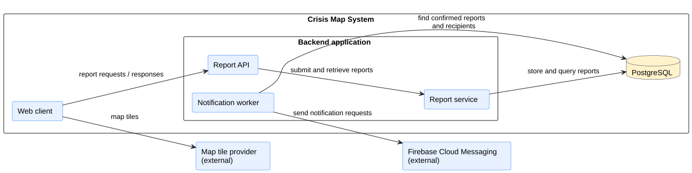
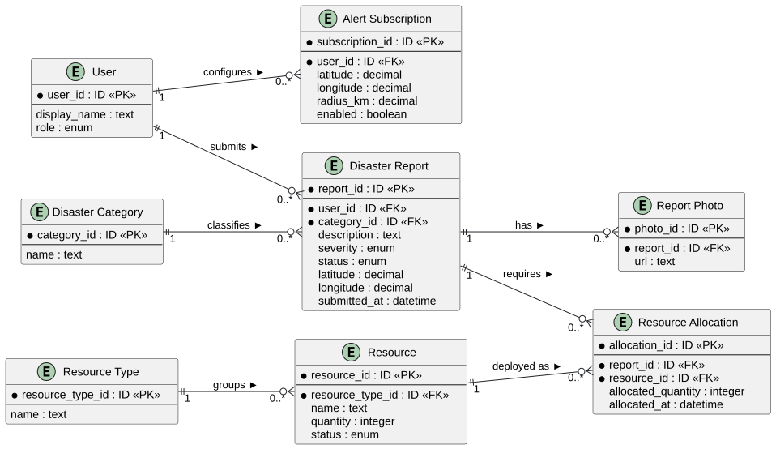
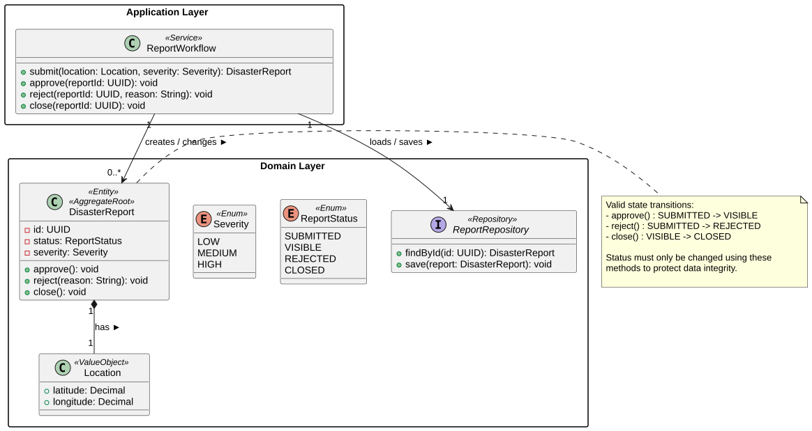
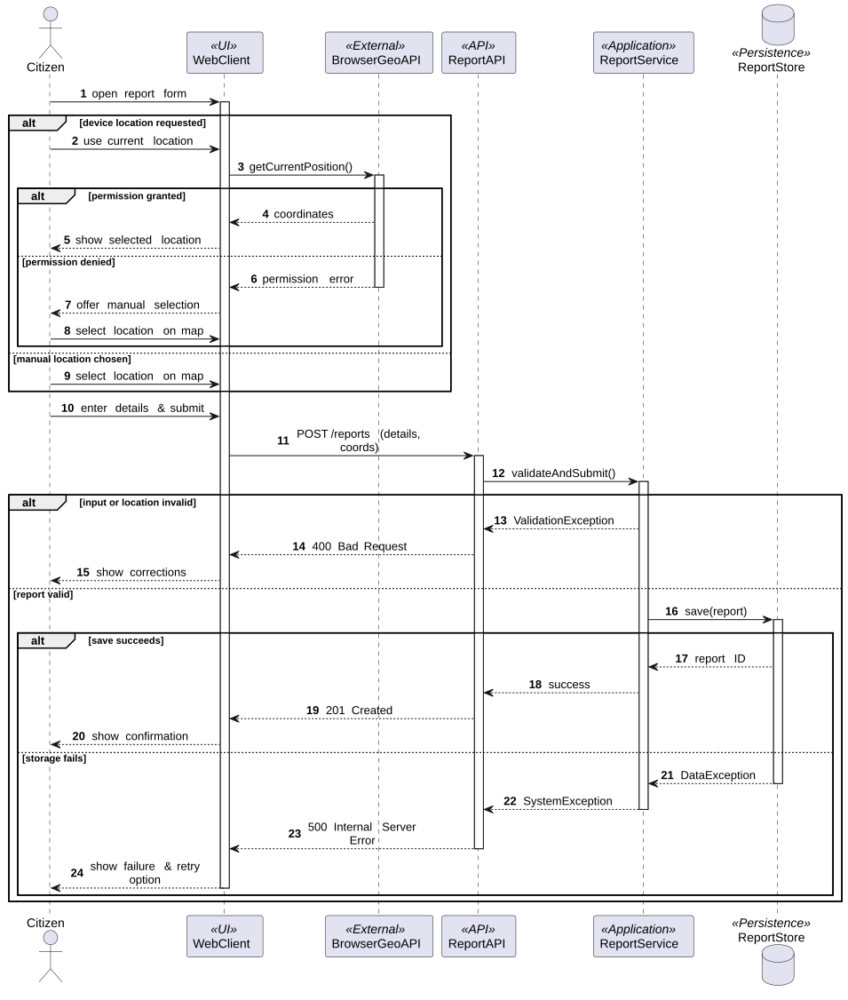
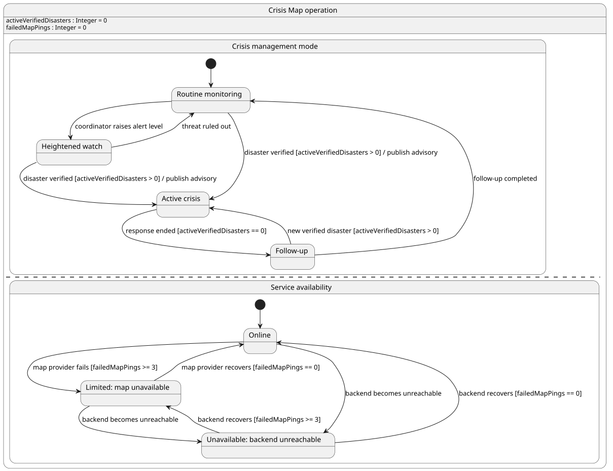

# 4. Arhitektura i oblikovanje

**Cilj:** Definirati arhitekturni stil, dekompoziciju programa na podsustave i module, organizaciju podataka te dinamičko ponašanje tijekom izvođenja. Arhitektura predstavlja temelj za implementaciju i ažurira se pri svakoj važnijoj promjeni projektnih odluka.

| Arhitekturni pogled | Ključno inženjersko pitanje | Primijenjeni model ili dijagram |
| :--- | :--- | :--- |
| **Strategija rješenja** | Koji stil i temeljne odluke određuju program? | Tablica odluka (odjeljak 4.1) |
| **Struktura podsustava** | Koji su glavni dijelovi i kako komuniciraju? | Dijagram komponenata |
| **Model podataka** | Kako su strukturirani trajni podaci programa? | Relacijski ER dijagram |
| **Struktura koda** | Kako su dodijeljene odgovornosti i ključne klase? | Reprezentativni dijagram razreda |
| **Dinamičko ponašanje** | Kako moduli surađuju pri obradi ključnih transakcija? | sekvencijski dijagram |
| **Stanja sustava** | Kako ključni domenski objekt mijenja svoja stanja? | Dijagram stanja |
| **Fizički razmještaj** | Na kojim se izvršnim čvorovima program izvodi? | Dijagram razmještaja (poglavlje 6) |

---

Za svaki UML dijagram čuvajte čitljivu sliku i PlantUML izvor, kako je opisano na stranici [Home](./Home.md). U dovršenoj stranici koristite vlastite projektne odluke i modele.

## 4.1 Strategija rješenja

**Cilj:** Objasniti nekoliko arhitekturnih odluka koje najviše utječu na rješenje i navesti njihove projektno specifične razloge.

| Odluka | Razmatrana alternativa | Projektno specifično obrazloženje i kompromis |
| --- | --- | --- |
|  |  |  |

Objasnite glavne arhitekturne odluke bez ponavljanja popisa tehnologija. Ako važna odluka ima ADR, dovoljno je u tablici navesti njegov ID.

<strong>Objašnjenje odabira</strong>

**Primjer — CrisisMap:**

| Odluka | Razmatrana alternativa | Projektno specifično obrazloženje i kompromis |
| --- | --- | --- |
| Klijent u pregledniku i jedan poslužiteljski API | Više zasebno postavljenih poslužiteljskih usluga | Klijent prikazuje kartu, dok poslužiteljski sustav provjerava i pohranjuje prijave. Jedan poslužiteljski sustav upravljiv je za ovaj opseg; njegov kvar može privremeno prekinuti rad s prijavama. Obrazloženje je u ADR-01. |
| Relacijska pohrana prijava | Dokumentno orijentirana pohrana | Prijave imaju prepoznatljive veze s korisnicima i lokacijama. Relacijska shema te veze čini eksplicitnima, ali zahtijeva migracije kada se shema promijeni. |

**Analiza primjera:** Obje odluke navode razlog vezan uz aplikaciju za prijavljivanje kriznih događaja i priznaju kompromis. Odluka o poslužiteljskom sustavu upućuje na ADR-01 umjesto ponavljanja cijele usporedbe. Moduli unutar jedne aplikacije koja se postavlja kao cjelina nisu zasebne mikrousluge. U vlastitoj tablici navedite alternative koje je tim doista razmatrao.

## 4.2 Gradivni blokovi i UML dijagram komponenata

**Cilj:** Prikazati logičku podjelu programa na komponente, njihova sučelja i vanjske integracije. Dijagram komponenata prikazuje logičku organizaciju, dok dijagram razmještaja prikazuje fizičko izvođenje. Ovaj pogled ažurirajte kako sustav poprima konačan oblik.

**Dijagram komponenata:** [Ugradite čitljiv UML dijagram komponenata.]  
**PlantUML izvor:** [Poveznica na odgovarajuću `.puml` datoteku.]

| Komponenta | Odgovornost | Razlog za ovu granicu |
| --- | --- | --- |
|  |  |  |

Započnite crtanjem granice oko predloženog sustava. Unutar nje prepoznajte dijelove s različitim odgovornostima; planiranu bazu podataka aplikacije smjestite unutar granice, a usluge trećih strana izvan nje. Važne veze označite podatkom ili uslugom koja njima prolazi. Logička komponenta može biti modul unutar jedne poslužiteljske aplikacije: zaseban pravokutnik ne znači zasebno postavljenu uslugu. Tijekom implementacije ažurirajte dijagram kada se promijene odgovornosti ili veze. U završnoj inačici čitatelj treba moći povezati njegove dijelove s kodom. Dijagram razmještaja odgovara na pitanje gdje se ti dijelovi stvarno izvode.

<strong>Granica sustava, odgovornosti i vanjske ovisnosti</strong>

**Primjer — CrisisMap:** Predložena arhitektura podržava podnošenje prijava kriznih događaja, prikaz na karti i obavijesti o potvrđenim prijavama.

**Slika 4.1. Dijagram komponenata sustava CrisisMap**

**PlantUML izvor:** [izvor](./puml/4-1-crisismap-system-CMP.puml)

| Dio | Odgovornost | Razlog za ovu granicu |
| --- | --- | --- |
| Web-klijent | Prikazuje prijave i prikuplja podatke za novu prijavu. | Korisnička interakcija odvojena je od pravila prijave i trajne pohrane. |
| API za prijave | Prihvaća zahtjeve za rad s prijavama i vraća odgovore. | Odgovornosti izložene putem HTTP-a odvojene su od obrade prijava. |
| Usluga za prijave | Primjenjuje pravila prijave i pristupa pohranjenim prijavama. | Pravila provjere valjanosti i pohrane prijava imaju jasno mjesto odgovornosti. |
| Proces za obavijesti | Određuje korisnike koji trebaju primiti obavijest i traži od vanjskog pružatelja da je pošalje. | Obrada obavijesti odvojena je od odgovaranja na korisnikov zahtjev za prijavu. |

**Analiza primjera:** Vanjska granica odvaja predloženi sustav od pružatelja karte i pružatelja obavijesti. Unutarnja granica grupira API za prijave, uslugu za prijave i proces za obavijesti unutar jedne poslužiteljske aplikacije; njihovi zasebni simboli prikazuju predložene odgovornosti, a ne neovisno postavljene usluge. PostgreSQL pohranjuje podatke aplikacije, dok pružatelj karte osigurava kartografske pločice. Strelice sažimaju ovisnosti, a ne redoslijed transakcije; taj redoslijed prikazuje sekvencijski dijagram. Izostavite proces za obavijesti i Firebase Cloud Messaging ako obavijesti nisu dio odobrenog opsega. Pružatelja prijave u sustav uključite samo ako to zahtijeva odobreni zadatak. Kako implementacija napreduje, ispravite svaku predloženu granicu koja se pokaže netočnom; završni dijagram mora odgovarati onome što je tim izgradio. Jedan koherentan pogled na komponente korisniji je od nekoliko gotovo jednakih inačica s proturječnim vezama.

## 4.3 Podaci i detaljno oblikovanje

**Cilj:** Objasniti važne informacije koje aplikacija pohranjuje i jedno reprezentativno područje oblikovanja na razini razreda. Model podataka i UML dijagram razreda odgovaraju na različita pitanja; jedno ne zamjenjuje drugo.

### 4.3.1 ER dijagram i model podataka

**Cilj:** Prikazati važne pohranjene entitete, njihove identifikatore i veze te dovoljno atributa za razumijevanje podataka aplikacije. ER dijagram odvojen je od reprezentativnog UML dijagrama razreda u nastavku.

**ER dijagram:** [Ugradite čitljiv dijagram projekta.]  
**Izvor dijagrama:** [Poveznica na njegov izvor.]  
**Implementacija:** [Navedite gdje je odgovarajući model podataka definiran u projektu.]

<strong>Jedna prijava poplave i povezani podaci</strong>

**Primjer — CrisisMap:** Ana putem svojeg korisničkog računa podnosi prijavu poplave `R-104`. Odabire lokaciju na karti i označava razinu ozbiljnosti kao visoku. Građanin može podnijeti više prijava; svaka prijava pripada jednoj kategoriji kriznog događaja, primjerice *Poplava*. Aplikacija pohranjuje prijavu i njezine koordinate. Kartografske pločice dolaze od vanjskog pružatelja i nisu entiteti u modelu podataka aplikacije.

**Slika 4.2. ER dijagram podataka sustava CrisisMap**

**PlantUML izvor:** [izvor](./puml/4-2-crisismap-data-ERD.puml)

**Analiza primjera:** `R-104` ima jednog autora i jednu kategoriju; Ana i kategorija *Poplava* mogu biti povezane s više prijava. Dijagram prikazuje veze bez prepisivanja svih stupaca baze podataka ili pisanja drugog tabličnog opisa za svaki entitet. Ako aplikacija prihvaća i **anonimne** prijave, tu mogućnost prikažite u vezi s entitetom `Citizen`. Ako su kategorije fiksne vrijednosti, a ne pohranjeni zapisi, nemojte izmišljati tablicu kategorija. Završni ER dijagram usporedite s modelom trajne pohrane i objasnite samo razlike važne za razumijevanje projekta.

### 4.3.2 Reprezentativni UML dijagram razreda

**Cilj:** Prije implementacije reprezentativnog dijela sustava modelirati i prikazati razrede ili sučelja potrebna za dodjelu odgovornosti, operacija i veza. Oblikovanje ažurirajte kada se te odluke promijene.

**Dijagram razreda:** [Ugradite čitljiv UML dijagram razreda za reprezentativni dio oblikovanja.]  
**PlantUML izvor:** [Poveznica na odgovarajuću `.puml` datoteku.]  
**Referenca na kod pri završnom pregledu:** [Poveznica na odgovarajuću implementaciju.]

<strong>Oblikovanje odgovornosti prijave i dopuštenih promjena</strong>

**Primjer — CrisisMap:** Prijava sadrži pravila za promjenu vlastitog statusa. Razred tijeka rada koordinira podnošenje i pregled, dok sučelje repozitorija opisuje potrebne operacije trajne pohrane. Dijagram predlaže te odgovornosti prije implementacije.

**Slika 4.3. Dijagram razreda za obradu prijava kriznih događaja**

**PlantUML izvor:** [izvor](./puml/4-3-crisismap-domain-CD.puml)

**Analiza primjera:** `DisasterReport` sadrži dopuštena pravila promjene stanja pa tijek rada ne može prešutno odobriti već odbijenu prijavu. `ReportWorkflow` koordinira operaciju bez preuzimanja pravila prijelaza stanja same prijave; `ReportRepository` definira potrebne operacije pohrane. Kompozicija `Location` i odabrani tipovi prikazuju veze korisne za oblikovanje. Dijagram namjerno izostavlja stupce baze podataka i nepovezane razrede: ER model objašnjava pohranjene podatke, dok ovaj dijagram dodjeljuje programske odgovornosti i operacije. Ti su razredi odluka oblikovanja, a ne obavezni slojevi za svaki tim. Završnu implementaciju usporedite s početnim oblikovanjem i ažurirajte dijagram tamo gdje su se odluke promijenile; generiranje dijagrama iz koda tek na kraju ne može zamijeniti ovo početno modeliranje.

## 4.4 Ponašanje tijekom izvođenja

**Cilj:** Objasniti jednu važnu interakciju među dijelovima koji se izvode i životni ciklus jednog smislenog objekta. Odaberite primjere koji otkrivaju odluke ili neuspješne putove umjesto izrade dijagrama za svaku CRUD radnju.

### 4.4.1 Reprezentativni UML sekvencijski dijagram

**Cilj:** Prikazati redoslijed poruka za jedan reprezentativni scenarij i odgovore na važnu alternativu.

**Scenarij:** [Naziv interakcije; dodajte UC ID ako postoji.]  
**sekvencijski dijagram:** [Ugradite čitljiv UML sekvencijski dijagram.]  
**PlantUML izvor:** [Poveznica na odgovarajuću `.puml` datoteku.]

<strong>Odabir lokacije, provjera valjanosti i podnošenje prijave</strong>

**Primjer — CrisisMap:** Građanin podnosi prijavu kriznog događaja nakon što ručno odabere lokaciju ili zatraži položaj uređaja. Interakcija prikazuje i što se događa kada je pristup lokaciji odbijen, podaci prijave nisu valjani ili pohrana ne uspije.

**Slika 4.4. Sekvencijski dijagram podnošenja prijave kriznog događaja**

**PlantUML izvor:** [izvor](./puml/4-4-crisismap-report-submission-SD.puml)

**Analiza primjera:** Dva načina odabira lokacije te alternative provjere i pohrane imaju različite posljedice za korisnika; usporedite ih s odgovarajućim obrascem uporabe i njegovim alternativnim tijekovima. API preglednika za lokaciju mogućnost je preglednika; web-klijent, API, usluga i pohrana odgovaraju prikazu komponenata. Odaberite grane koje pomažu objasniti scenarij vašeg projekta i završni dijagram uskladite s implementiranom interakcijom.

### 4.4.2 Reprezentativni UML dijagram stanja

**Cilj:** Prikazati važna stanja jednog domenskog objekta ili eksplicitno upravljanog načina rada sustava te događaje ili uvjete koji ih mijenjaju.

**Vlasnik stanja i razlog odabira:** [Navedite objekt ili način rada sustava, kako se njegovo stanje prepoznaje i zašto su prijelazi važni.]  
**Dijagram stanja:** [Ugradite čitljiv UML dijagram stanja.]  
**PlantUML izvor:** [Poveznica na odgovarajuću `.puml` datoteku.]

<strong>Načini rada i dostupnost usluge</strong>

**Primjer — CrisisMap:** Način koordinacije kriznog događaja mijenja se kako se događaj procjenjuje i rješava. Istodobno se korisniku vidljiva dostupnost aplikacije može neovisno mijenjati kada pružatelj karte ili poslužiteljski sustav postanu nedostupni.

**Slika 4.5. Dijagram stanja prijave kriznog događaja**

**PlantUML izvor:** [izvor](./puml/4-5-crisismap-report-SM.puml)

**Analiza primjera:** Dvije regije opisuju neovisne aspekte modeliranog sustava: način koordinacije kriznog događaja i opaženu dostupnost usluge. Izvode se paralelno; aktivni krizni događaj može postojati uz normalno ili ograničeno pružanje usluge. Grane nakon oporavka poslužiteljskog sustava uzimaju u obzir da pružatelj karte možda i dalje nije dostupan. Prijelazi stanja imaju imenovane okidače ili uvjete umjesto da budu samo popis zaslona. Ovaj oblik koristite samo ako aplikacija stvarno održava ili pouzdano izvodi obje vrste stanja. Projekt čiji važan životni ciklus pripada prijavi, rezervaciji ili narudžbi treba modelirati taj objekt; složenost dijagrama nije kriterij vrednovanja. Pri završnom pregledu model stanja usporedite s ponašanjem koje pokrenuta aplikacija stvarno podržava.

## 4.5 Zapisi arhitekturnih odluka

**Cilj:** Sačuvati razloge i obrazložiti odabrane važne arhitekturne odluke kada tablica u odjelku 4.1 nije dovoljna za očuvanje konteksta, razmatranih alternativa i prihvaćenih kompromisa.

Napišite nekoliko ADR-a samo za važne odluke čije obrazloženje, alternative i kompromis treba sačuvati. Ostale arhitekturne odluke dovoljno je zabilježiti u tablici.

**Detaljni zapis arhitekturne odluke (engl. Architecture Decision Record, ADR), kada odluka zahtijeva dodatno objašnjenje:**

### ADR-[ID]: [Naslov odluke]

| Polje | Zapis odluke |
| --- | --- |
| Kontekst i cilj | [Koji je arhitekturni problem učinio ovu odluku potrebnom?] |
| Kriteriji odluke | [Što je timu stvarno bilo važno?] |
| Razmatrane alternative | [Realne mogućnosti koje je tim razmotrio, ukratko.] |
| Odluka i obrazloženje | [Odabrana mogućnost, zašto je odabrana i čega se tim odrekao.] |
| Status | [Predloženo, prihvaćeno ili zamijenjeno; ako je primjenjivo, poveznica na novu odluku.] |

ADR pišite samo za odluku čije će obrazloženje ostati važno i nakon promjene implementacije. Značajna promjena odluke može se zabilježiti novim ADR-om koji zamjenjuje stari; rutinski odabiri alata ne trebaju detaljne zapise. Promjene dogovorenog opsega pripadaju zahtjevima i njihovoj povijesti promjena; povratna informacija o zadatku ostaje uz odgovarajući zadatak.

<strong>Odabir jednog poslužiteljskog sustava umjesto zasebno postavljenih usluga</strong>

**Primjer — CrisisMap, ADR-01:**

| ID | Datum | Odluka | Razmatrana alternativa | Obrazloženje i kompromis | Status |
| --- | --- | --- | --- | --- | --- |
| ADR-01 | [Datum odluke] | Jedan poslužiteljski API za obradu prijava | Zasebno postavljene usluge za prijave i resurse | Manji napor postavljanja i integracije za odobreni opseg; kvar poslužiteljskog sustava može utjecati na obje funkcionalnosti. | Prihvaćeno |

### ADR-01: Jedan poslužiteljski API za obradu prijava

| Polje | Zapis odluke |
| --- | --- |
| Kontekst i cilj | Tim tijekom jednog semestra mora izraditi i javno postaviti prijavljivanje kriznih događaja i prikaz usmjeren na kartu. |
| Kriteriji odluke | Tim može izraditi, integrirati, postaviti i objasniti rješenje; komponente i dalje imaju prepoznatljive odgovornosti. |
| Razmatrane alternative | **Jedan poslužiteljski sustav:** moduli dijele aplikaciju koja se postavlja kao cjelina. **Zasebne usluge:** svaka se može izvoditi neovisno, ali zahtijeva dodatni rad na integraciji i postavljanju. |
| Odluka i obrazloženje | Odabrati jedan poslužiteljski sustav s jasno odvojenim odgovornostima vezanim uz prijave. Time se smanjuje rad na postavljanju, uz prihvaćanje da kvar tog sustava može istodobno utjecati na rad s prijavama. |
| Status | Prihvaćeno. |

**Analiza primjera:** Strategija rješenja navodi trenutačni pristup; ADR-01 čuva alternative i kriterije koji su do njega doveli. Dijagrami komponenata i razmještaja trebaju odražavati odabrani pristup kako se sustav razvija. Zaseban ADR koristan je za važnu odluku, a ne za svaki odabir alata.

## 4.6 Koncepti koji prožimaju sustav

**Cilj:** Prepoznati važan mehanizam ili pravilo oblikovanja koje se primjenjuje u više dijelova aplikacije, opisati gdje se planira primijeniti i ažurirati objašnjenje kako implementacija poprima konačan oblik. Uključite samo koncepte koji su važni za ovaj projekt.

| Aspekt | Mehanizam i mjesto primjene | Dokaz u završnoj implementaciji |
| --- | --- | --- |
|  |  |  |

<strong>Opis zajedničkog pravila kroz njegovu implementaciju</strong>

**Primjer — CrisisMap:**

| Aspekt | Mehanizam i mjesto primjene | Referenca na kod ili konfiguraciju |
| --- | --- | --- |
| Pravilo sustava: autorizacija moderiranja prijava | Poslužiteljski sustav provjerava ovlasti moderatora prije odobravanja ili odbijanja prijave; gumb za prijavu u klijentu nije dovoljna zaštita. | Pri završnom pregledu pokažite provjeru ovlasti u poslužiteljskom sustavu i ispitivanje neovlaštenog pristupa. |
| Zajedničko implementacijsko pravilo: provjera lokacije | Granica podnošenja prijave odbija nedostajuće ili nevaljane koordinate prije pohrane prijave. | Pri završnom pregledu pokažite pravilo provjere i ispitivanje s nevaljanim koordinatama. |

**Analiza primjera:** Prvi redak opisuje zaštitu preko granice sustava; drugi pravilo zajedničko različitim putovima podnošenja prijave. Odaberite aspekte koji stvarno utječu na vaš projekt.

Obrasci poput Dependency Injection ili Repository pripadaju ovdje samo kada ih kod stvarno koristi i kada objašnjavaju zajedničko pravilo oblikovanja. Tvrdnja „sustav koristi autentikaciju” sama po sebi ne govori čitatelju gdje se provjera provodi niti što štiti. Sigurnost, bilježenje događaja i obrada pogrešaka ne trebaju svaki zaseban pododjeljak po zadanom pravilu.

## 4.7 Arhitekturni rizici i tehnički dug

**Cilj:** Navesti stvarne tehničke ili domenske rizike i svjesno prihvaćene kompromise oblikovanja, njihove posljedice i način na koji ih tim obrađuje.

**Tehnički rizici i dug**

| Rizik ili kompromis | Posljedica | Trenutačni pristup |
| --- | --- | --- |
|  |  |  |

**Poslovni ili domenski rizici, ako su značajni**

| Rizik | Posljedica | Trenutačni pristup |
| --- | --- | --- |
|  |  |  |

<strong>Prepoznavanje ograničenja bez izmišljanja produkcijske infrastrukture</strong>

**Primjer — CrisisMap, tehnički rizici:**

| Rizik ili kompromis | Posljedica | Trenutačni pristup |
| --- | --- | --- |
| Jedna instanca aplikacije obrađuje podnošenje prijava. | Kvar smještaja aplikacije privremeno onemogućuje nove prijave. | Prihvaćeno u okviru projekta kolegija; tim ne tvrdi da postoji automatsko prebacivanje na pričuvni sustav. |
| Vanjske kartografske pločice nisu dostupne. | Prikaz karte može prestati raditi iako su pohranjene prijave i dalje dostupne. | Objasnite korisniku vidljivu pogrešku ili alternativu koju implementirana aplikacija stvarno pruža. |

**Primjer — CrisisMap, domenski rizik:** Čitatelji mogu neprovjerenu prijavu građanina zamijeniti za službeno upozorenje. Tim može u sučelju jasno razlikovati status provjere prijave i uputiti korisnike na službene izvore.

**Analiza primjera:** Prvi tehnički rizik prihvaća realistično ograničenje projekta kolegija; domenski se rizik odnosi na način na koji čitatelj tumači prijavu. Zabilježite ograničenje i realan odgovor koji pripadaju vašem projektu. Neostvarena obavezna funkcionalnost nije tehnički dug nego nedovršen opseg.

**Završna provjera:** Usporedite dijagrame komponenata, podataka, razreda, sekvencijski dijagram i dijagram stanja s implementiranim kodom, ponašanjem aplikacije i stvarnim razmještajem. Ažurirajte zastarjele opise oblikovanja i objasnite svaku važnu razliku koja ostaje; poveznice na odgovarajući kod ili ispitivanja korisne su kada odgovaraju na konkretno pitanje.
