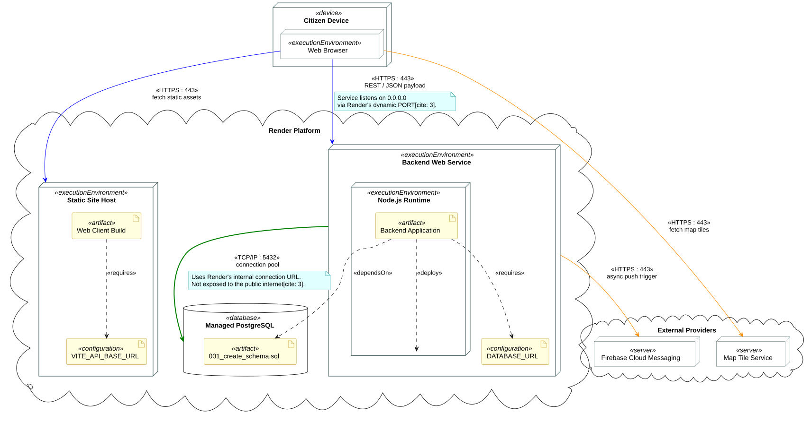

# 6. Postavljanje, instalacija i konfiguracija

**Cilj:** Detaljno dokumentirati topologiju izvođenja, postupak lokalne instalacije i konfiguracije iz izvornog koda te način javnog postavljanja i administracije programa. [README](../README.md) navodi javnu adresu i sažeti postupak lokalnog pokretanja; ova stranica donosi potpun inženjerski postupak koji osigurava točnu ponovljivost na drugom računalu.

Zamijenite oglednu topologiju, naredbe i postavke onima koje vaš tim stvarno koristi (u primjeru se koristi Render; dokumentirajte platformu odabranu za vaš projekt).

---

## 6.1 Prikaz razmještaja

**Cilj:** Prikazati okruženja izvođenja, raspodijeljene dijelove programa, spremište podataka i relevantne vanjske usluge. Njihovu komunikaciju i mrežne protokole prikažite jednim UML dijagramom razmještaja. Dok dijagram komponenata iz Poglavlja 4 prikazuje logičke odgovornosti, dijagram razmještaja pokazuje gdje se izvršni artefakti fizički ili virtualno izvode.

**Dijagram razmještaja:** [Ugradite čitljivu sliku UML dijagrama razmještaja.]  
**PlantUML izvor:** [Poveznica na odgovarajuću `.puml` datoteku.]  
**Javno dostupna aplikacija:** [Poveznica na javnu adresu navedenu u README-u ili na njegov odjeljak o postavljanju.]

*Pravila izrade prikaza:*
* Označite stvarne čvorove na kojima se program izvodi (korisnički uređaj, poslužitelj, baza podataka) i protokole među njima.
* Bazu podataka ili vanjskog pružatelja usluga uključite samo ako ih postavljeni program stvarno koristi.
* Razvojno računalo nije javni poslužitelj; prikažite isključivo produkcijsko okruženje.
* Ako se planirana arhitektura tijekom implementacije promijenila, ovdje prikažite stvarni razmještaj i odgovarajuće ažurirajte opis arhitekture.

<details>
<summary><strong>Primjer: Javno postavljanje programa za prijave i obavijesti </strong></summary>

**Primjer — CrisisMap:**
Predloženi klijentski dio gradi se kao statičko web-mjesto. Poslužiteljska web-usluga obrađuje prijave i asinkrono šalje obavijesti unutar **iste postavljene poslužiteljske aplikacije**. PostgreSQL sprema podatke prijava, pružatelj kartografskih pločica poslužuje kartu pregledniku, a Firebase Cloud Messaging prima zahtjeve za slanje upozorenja iz poslužiteljskog dijela. Primjer pretpostavlja da obavijesti pripadaju opsegu tog konkretnog projekta.



**Slika 6.1. UML dijagram razmještaja sustava CrisisMap**

**PlantUML izvor:** [izvor](./puml/6-1-crisismap-DD.puml)
**Analiza razmještaja:**
* **Korisnički uređaj:** Web-preglednik izvršava klijentski kod nakon preuzimanja statičkih datoteka.
* **Poslužiteljski čvor:** Poslužiteljski API i pozadinski zadaci nalaze se unutar jedne usluge (jednog izvršnog procesa).
* **Baza podataka:** Veza s bazom uspostavlja se isključivo iz poslužiteljskog dijela putem interne mreže, a nikada izravno iz klijentskog preglednika.
* **Vanjske usluge:** Kartografski poslužitelj i servis za obavijesti nalaze se izvan infrastrukture koju postavlja tim.
</details>

---

## 6.2 Lokalna instalacija i konfiguracija

**Cilj:** Omogućiti novom članu tima ili ocjenjivaču da iz čiste radne kopije repozitorija instalira i lokalno pokrene cijeli programski sustav, uključujući bazu podataka i početne podatke.

1. **Preduvjeti i preuzimanje izvornog koda:**
   * Navedite podržane verzije izvršnog okruženja, upravitelja paketa, baze podataka i CLI alata.
   * Navedite točne naredbe za kloniranje repozitorija i radni direktorij; naznačite koje se naredbe pokreću iz korijena repozitorija, a koje iz poddirektorija.
2. **Ovisnosti i konfiguracijske varijable:**
   * Navedite točne naredbe za instalaciju ovisnosti za klijentski i poslužiteljski dio.
   * Povežite predložak `.env.example`, opišite ulogu svake varijable, koje vrijednosti smiju biti javne i kako ovlašteni korisnik dobiva tajne vrijednosti.
   * *Upozorenje:* Nikada ne objavljujte stvarne pristupne podatke i tajne ključeve.
3. **Inicijalizacija baze podataka i migracije:**
   * Navedite redoslijed naredbi za stvaranje lokalne baze, dodjelu korisničkih prava i izvođenje migracija sheme; navedite izvode li se migracije ručno ili pri pokretanju te stvarne putanje verzioniranih skripti.
   * Objasnite kako se učitavaju nužni početni podaci (samo oni nužni) i kako spriječiti višestruko izvođenje početnih skripti.
4. **Pokretanje i verifikacija:**
   * Prikažite točan redoslijed pokretanja procesa i lokalne mrežne adrese na kojima su dostupni.
   * Navedite točan korak provjere (npr. slanje probnog zahtjeva ili pregled u pregledniku) koji dokazuje da klijentski dio uspješno komunicira s poslužiteljskim API-jem i bazom te da se važni podaci trajno pohranjuju.
   * Navedite gdje čitatelj može provjeriti pogreške ako neki korak ne uspije.

Uključite samo korake koje aplikacija stvarno zahtijeva. Ako README već sadrži potpun i ponovljiv postupak, povežite ga i ovdje dodajte samo ono što nedostaje umjesto održavanja dviju potpunih kopija istih uputa.

<details>
<summary><strong>Primjer: Instalacija programa s lokalnom PostgreSQL bazom (CrisisMap)</strong></summary>

Ovaj nastavni primjer koristi klijentski dio temeljen na radnom okviru React/Vite (`frontend/`), poslužiteljski dio temeljen na Node.js okruženju (`backend/`) i PostgreSQL bazu podataka.

#### 1. Inicijalizacija baze podataka

U terminalu stvorite razvojnu bazu podataka i pokrenite početnu SQL skriptu iz korijena repozitorija:

```bash
createdb crisismap_dev
psql -d crisismap_dev -f backend/db/001_create_schema.sql
psql -d crisismap_dev -c '\dt'
```

Verzionirana SQL datoteka u ovom primjeru stvara tablice u **novoj** bazi podataka; provjera `\dt` treba ih prikazati. Konfigurirajte lokalni PostgreSQL račun koji može koristiti tu shemu; ako je riječ o zasebnom računu, zabilježite naredbe za njegovo stvaranje i dodjelu prava. Node.js poslužiteljski dio čita `DATABASE_URL`: lokalno ga postavite tako da se putem PostgreSQL URL-a povezuje na `crisismap_dev`, a potrebne pristupne podatke čuvajte u lokalnoj postavci koja se ne uključuje u repozitorij. Nemojte objaviti puni URL veze ako sadrži lozinku. Ako druga aplikacija koristi automatske migracije, pokrenite je prema uputama i provjerite jesu li migracije provedene umjesto zasebnog izvršavanja skripte početne sheme. Ako ogledne prijave zahtijevaju početne podatke, navedite stvarnu naredbu tog projekta i objasnite kada se treba koristiti.

#### 2. Konfiguracija i pokretanje poslužiteljskog dijela (backend)

U prvom terminalu postavite ovisnosti, pripremite varijable okruženja i pokrenite poslužitelj:

```bash
cd backend
npm ci
cp .env.example .env
# Uredite .env datoteku: postavite DATABASE_URL=postgresql://localhost:5432/crisismap_dev
npm start
```

*Poslužiteljski API pokreće se i sluša na:* `http://localhost:8080`

#### 3. Pokretanje klijentskog dijela (frontend)

U drugom terminalu instalirajte ovisnosti klijenta i pokrenite razvojni poslužitelj:

```bash
cd frontend
npm ci
VITE_API_BASE_URL=http://localhost:8080 npm run dev
```

*Klijentska aplikacija dostupna je u pregledniku na:* `http://localhost:5173`

#### 4. Provjera rada sustava

Otvorite adresu klijenta koju ispiše Vite, podnesite probnu prijavu s odabranom lokacijom, provjerite prikazuje li se potvrda s novim identifikatorom prijave i ponovno je dohvatite. Samo učitavanje početne stranice klijenta bez slanja i dohvata podataka ne dokazuje ispravnost rada poslužiteljskog dijela i baze podataka.

Ako se adresa poslužiteljskog dijela razlikuje od `http://localhost:8080`, koristite adresu koju aplikacija stvarno ispiše. Ako podnošenje ne uspije, pregledajte API zahtjev u pregledniku i zapis poslužiteljskog dijela; ako pokretanje ne uspije, provjerite postavke veze s bazom podataka i je li shema stvorena. Nemojte kopirati putanje ili naredbe iz ovog primjera ako se vaš repozitorij razlikuje.

**Analiza primjera:** Postupak ima jasan redoslijed: stvoriti bazu podataka, uspostaviti shemu i pristup, konfigurirati veze, pokrenuti oba procesa i provjeriti spremljenu prijavu. Naredbe i očekivani rezultati dovoljno su konkretni da se može dijagnosticirati nepotpuno postavljanje. Oni nadopunjuju kratki put iz README-a do pokrenute aplikacije umjesto da tvrde kako samo učitana web-stranica dokazuje uspješnu instalaciju.
</details>

---

## 6.3 Javno postavljanje i administracija

**Cilj:** Dokumentirati točne korake za ponovljivo postavljanje cjelovitog programskog sustava na produkcijsku infrastrukturu u oblaku, uključujući smještenu bazu podataka i veze među postavljenim dijelovima. Kada je jasnije, povežite konfiguraciju koja već postoji u Gitu umjesto njezina prepisivanja.

| **Postavljeni podsustav** | **Infrastruktura i izvor koda** | **Naredbe izgradnje i pokretanja** | **Konfiguracija i varijable okruženja** |
| --- | --- | --- | --- |
| **Klijentski dio** | [Usluga smještaja, grana i putanja mape] | [Naredba izgradnje i izlazni direktorij] | [Javne varijable vidljive pregledniku] |
| **Poslužiteljski dio** | [Usluga smještaja, grana i putanja mape] | [Naredba izgradnje i naredba pokretanja] | [Port, veza s bazom podataka, tajni ključevi] |
| **Baza podataka** | [Upravljana baza podataka i regija smještaja] | [Mehanizam izvođenja migracija sheme i trenutak uspostavljanja sheme] | [Zaštićeni pristupni podaci baze] |

**CI i CD:** Kontinuirana integracija (engl. *continuous integration*, CI) automatizira izgradnju i provjere pri integriranju promjena. Kratica CD može označavati dva različita postupka. **Kontinuirana isporuka** (engl. *continuous delivery*) održava provjerenu inačicu spremnom za postavljanje, ali postavljanje u produkciju može zahtijevati ručnu odluku. **Kontinuirano postavljanje** (engl. *continuous deployment*) automatski postavlja uspješno provjerenu promjenu u produkciju. Navedite postupak koji projekt stvarno koristi; nemojte koristiti oznaku CI/CD samo zato što alat podržava automatizaciju.
U tablici i opisu navedite **nazive i svrhu** varijabli, gdje ovlašteni održavatelj dobiva njihove vrijednosti i kojoj se usluzi svaka postavlja. Razlikujte konfiguraciju vidljivu pregledniku od tajnih podataka poslužiteljskog dijela.

### Postupak postavljanja

1. **Infrastruktura baze podataka:** [Postupak kreiranja instance baze i primjene migracija.]
2. **Postavljanje poslužiteljskog dijela:** [Povezivanje repozitorija, postavljanje tajnih varijabli i pokretanje.]
3. **Izgradnja i objava klijentskog dijela:** [Postavljanje javnog URL-a poslužitelja i generiranje statičkih datoteka.]
4. **Završno povezivanje:** [Postavljanje dozvoljenih ishodišta (CORS) i verifikacija javne domene.]

### Pristup i administracija

- **Nadzor rada i zapisi pogrešaka:** [Objasnite gdje i kako ovlašteni članovi tima pristupaju zapisima poslužitelja (engl. *logs*) te kako pregledati pogreške aplikacije.]
- **Upravljanje administratorskim ovlastima:** [Ako aplikacija ima administratorsku ili moderatorsku ulogu, navedite putanju do sučelja i proceduru dodjele uloge bez javnog otkrivanja pristupnih podataka. Ako nema administratorskog sučelja, to kratko navedite.]
- **Postupak ažuriranja:** [Opišite kako izmjena iz glavne grane dolazi do postavljene aplikacije. Navedite izvodi li se postavljanje ručno, kontinuiranom isporukom ili kontinuiranim postavljanjem te koje provjere prethode postavljanju.]
- **Sigurnosne kopije i oporavak:** [Dokumentirajte samo ako ga je tim stvarno konfigurirao i koristio.]

Opisujte samo okruženja i automatizirane postupke koji stvarno postoje. Okruženje za pripremu, kontinuirana integracija (CI), kontinuirana isporuka ili kontinuirano postavljanje (CD), krajnja točka za provjeru stanja, sigurnosne kopije i druge operativne mogućnosti navode se samo ako ih tim stvarno koristi.
<details>
<summary><strong>Primjer konfiguriranja statičkog web-mjesta, poslužiteljskog dijela i baze podataka na Renderu</strong></summary>

**Primjer — CrisisMap:**

Jedno izvedivo postavljanje prethodno opisanog Node.js nastavnog primjera koristi sljedeće usluge Rendera. Lokalna PostgreSQL baza iz odjeljka 6.2 odvojena je od upravljane baze koja poslužuje javnu aplikaciju.

| **Postavljeni podsustav** | **Izvor i konfiguracija izgradnje / pokretanja** | **Potrebne varijable i mrežne veze** |
| --- | --- | --- |
| **Statičko web-mjesto** (klijent) | Mapa `frontend/`; grana `main`; izgradnja `npm ci && npm run build`; direktorij objave `dist/`. | `VITE_API_BASE_URL` postavljen na javni URL poslužiteljskog dijela. To je konfiguracija vidljiva pregledniku, a ne tajna vrijednost. |
| **Web-usluga** (poslužitelj) | Mapa `backend/`; Node.js okruženje; izgradnja `npm ci`; pokretanje `npm start`. | `DATABASE_URL` (**interni** URL Render baze), `PORT` (dodjeljuje platforma). Poslužitelj mora slušati `PORT` na `0.0.0.0`. Po potrebi konfigurirajte dopušteno ishodište klijenta (CORS). |
| **Upravljani PostgreSQL** | Baza stvorena u istoj Render regiji kao i web-usluga; početnu shemu primijenite na **novu** bazu prije posluživanja zahtjeva za prijave. | Podatke veze dohvatite iz nadzorne ploče baze i čuvajte ih privatnima. Kasnije migracije primjenjujte zasebno umjesto ponovnog izvođenja početne skripte. |
| **Pružatelj obavijesti** | Integraciju konfigurirajte u poslužiteljskom dijelu samo ako pripada odobrenom projektu i implementirana je. | Poslužiteljski pristupni podatak unesite kroz tajne postavke platforme; dokumentirajte njegov **naziv**, nikada vrijednost. |

#### Koraci izvođenja na Renderu

1. **Stvaranje baze podataka:** U nadzornoj ploči Rendera stvorite PostgreSQL bazu u regiji u kojoj će se izvoditi poslužiteljski dio. Interni URL baze čuvajte za poslužiteljski dio; nemojte ga unositi u dokumentaciju ni u postavke klijenta.
2. **Inicijalizacija produkcijske sheme:** Ako baza dopušta vanjsku vezu, iz pouzdanog terminala u korijenu repozitorija povežite se uputom za PSQL iz nadzorne ploče. U otvorenoj `psql` sesiji pokrenite:

   ```sql
   \i backend/db/001_create_schema.sql
   \dt
   ```

   *Napomena:* Naredbu za povezivanje koja sadrži pristupne podatke nikada ne kopirajte u repozitorij ni dokumentaciju. Ako su vanjske veze onemogućene, opišite stvarni ovlašteni mehanizam migracije svog tima. Početnu skriptu ne pokrećite ponovno pri svakom postavljanju.
3. **Pokretanje poslužiteljske web-usluge:** Povežite repozitorij, odaberite Node.js okruženje i odgovarajuću granu, postavite korijenski direktorij na `backend/`, naredbu izgradnje na `npm ci` i naredbu pokretanja na `npm start`. U privatne postavke okruženja dodajte `DATABASE_URL` s **internim** URL-om baze. Poslužitelj konfigurirajte da sluša na `0.0.0.0` i portu iz varijable `PORT`. Nakon uspješnog postavljanja zabilježite javnu adresu usluge (npr. `https://crisismap-api.onrender.com`).
4. **Izgradnja klijentskog web-mjesta:** Povežite repozitorij, odaberite `frontend/`, naredbu izgradnje `npm ci && npm run build` i mapu objave `dist/`. Prije izgradnje postavite `VITE_API_BASE_URL` na **javnu adresu poslužitelja**; ovdje nikada ne koristite privatni URL baze. Zabilježite generiranu javnu adresu web-mjesta.
5. **Povezivanje i verifikacija produkcijskog rada:** Ako poslužitelj ograničava ishodišta preglednika, dopustite javnu adresu statičkog web-mjesta i ponovno postavite poslužiteljski dio. Otvorite javnu adresu klijenta, podnesite prijavu i ponovno je dohvatite kako biste potvrdili trajno spremanje. Zabilježite javni URL web-mjesta u `README.md`.
6. **Održavanje:** Ako postavljanje ne uspije, pregledajte izlaz i zapise postavljanja usluge u Renderu. Za novu reviziju koristite konfigurirano automatsko postavljanje iz repozitorija ili ručnu radnju postavljanja iz nadzorne ploče. Pristupni podatak za obavijesti konfigurirajte samo u poslužiteljskom dijelu i samo ako je ta funkcionalnost stvarno implementirana. Automatsko pokretanje postavljanja nakon promjene u repozitoriju samo po sebi nemojte nazivati kontinuiranim postavljanjem (CD) ako projekt nema definiran automatizirani tijek provjera koji promjena mora uspješno proći prije postavljanja.

Tim zamjenjuje ogledne nazive direktorija, naredbe, mehanizam sheme i postavke vrijednostima koje rade u vlastitom repozitoriju. Ako obavijesti nisu dostupne, integraciju dokumentirajte iskreno; uspješno podnošenje prijave ne dokazuje uspješnu dostavu obavijesti.

Ako aplikacija uključuje moderatorsko sučelje, navedite njegovu putanju i objasnite kako se moderatorski račun dodjeljuje kroz aplikaciju ili odobreni postupak tima. Nemojte objaviti zadanu lozinku. Oporavak baze podataka opisujte samo ako je tim uspostavio uporabljiv postupak sigurnosnog kopiranja; nemojte implicirati da upravljani smještaj automatski jamči oporavak.

**Analiza primjera:** API i obrada obavijesti ostaju u jednom postavljanju poslužiteljskog dijela, kao na dijagramu. Postupak razlikuje Renderovu internu vezu s bazom od javnog URL-a poslužitelja koji koristi klijent te uspostavlja shemu prije obrade prijava. Izgradnja klijenta dobiva samo konfiguraciju vidljivu pregledniku; tajni podaci baze i pružatelja ostaju u poslužiteljskom dijelu. Render je samo jedan nastavni primjer pa druga platforma zahtijeva opis vlastitog postupka.
</details>

---

>**Završna provjera:** Upute za lokalno pokretanje omogućuju podizanje cjelokupnog sustava iz čiste kopije repozitorija bez neprenosivih lokalnih staza. Dijagram razmještaja prikazuje samo stvarno produkcijsko okruženje, njegove čvorove i protokole. Poveznica na javnu aplikaciju provjerena je, vodi na postavljenu verziju programa i jednaka je onoj u `README.md`. Administracijske upute opisuju samo mogućnosti koje tim stvarno pruža. Nijedna datoteka dokumentacije, konfiguracijski primjer niti zapis promjene ne sadrži stvarne pristupne podatke, privatne tokene ili lozinke.
